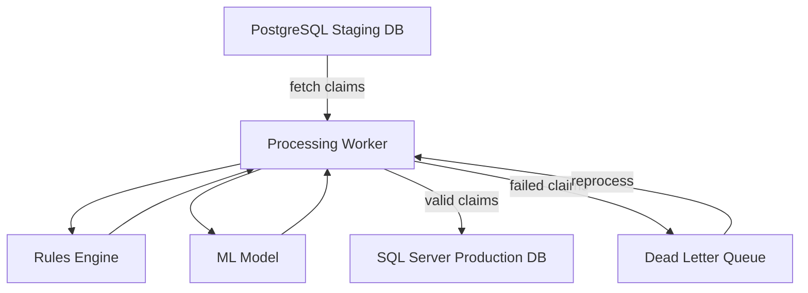

# System Architecture

The claims processing pipeline consists of distinct components interacting through databases and a messaging layer.

The FastAPI application exposes operational endpoints for monitoring and reviewing failed claims. Caching and connection pools improve throughput under load.

Failed claims are first stored in the dead letter queue. On startup they are
loaded into a priority retry queue which attempts automated repair before
another insertion attempt. Claims that still fail can be assigned to a user for
manual resolution and the outcome is tracked for metrics.
