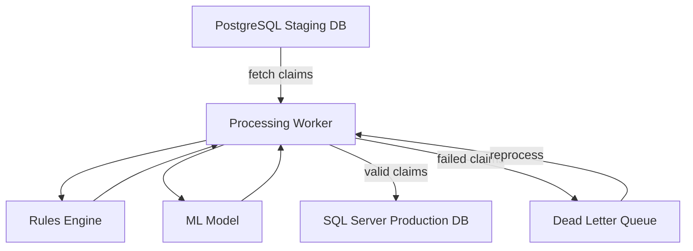

# System Architecture

The claims processing pipeline consists of distinct components interacting through databases and a messaging layer.

The FastAPI application exposes operational endpoints for monitoring and reviewing failed claims. Caching and connection pools improve throughput under load.
